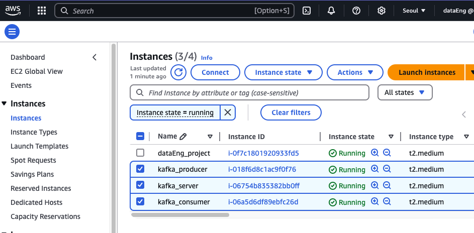

# kafka-on-EC2
## Intro.
Kafka data flow hands-on with public data. Created three EC2 instances to simulating the message broker.

1. **Producers**:
   - Fetch public real estate transaction data from S3 storage.
   - Generate Kafka topics,`apartinfo`.
   - Send the data to the queue via Logstash.

2. **Kafka Cluster**:
   - Central message broker that manages topics and queues.
   - Contains Topics(`apartinfo` in this case)

3. **Consumers**:
   - Subscribes to topics in the Kafka cluster.
   - Receives and processes data from the cluster.
   - Runs python script to displays recieved data with polling every second.

```
Producer --> Kafka Cluster(Queue) --> Consumer
```


 **1. Create EC2** 

 **Connect to EC2**
   ```bash
   $ ssh -i "dataEng-seoul.pem" ec2-user@<your-ec2-public-ip>.ap-northeast-1.compute.amazonaws.com
   ```

## Kafka Setup on EC2

### Create 3 EC2 Instances for Kafka
- Use medium-type instances.

### Install Kafka

1. **Download and Extract Kafka**
   ```bash
   $ wget https://downloads.apache.org/kafka/3.6.1/kafka_2.13-3.6.1.tgz
   $ tar xvf kafka_2.13-3.6.1.tgz
   $ ln -s kafka_2.13-3.6.1 kafka
   ```

2. **Start Kafka Services**
   ```bash
   $ cd kafka
   $ ./bin/zookeeper-server-start.sh config/zookeeper.properties &
   $ ./bin/kafka-server-start.sh config/server.properties &
   ```

3. **Verify Services**
   ```bash
   $ sudo netstat -anp | egrep "9092|2181"
   ```

4. **Create a Kafka Topic**
   ```bash
   $ bin/kafka-topics.sh --create --topic apartinfo --partitions 1 --replication-factor 1 --bootstrap-server localhost:9092 &
   ```

5. **List Topics**
   ```bash
   $ bin/kafka-topics.sh --list --bootstrap-server localhost:9092
   ```

6. **Consume Messages**
   ```bash
   $ ./bin/kafka-console-consumer.sh --bootstrap-server localhost:9092 --topic apartinfo --from-beginning
   ```

---

## Kafka Producer and Consumer Setup

### Install Logstash for the both `Producer` and `Consumer`
1. **Add Logstash Repository**
   ```bash
   $ sudo rpm --import https://artifacts.elastic.co/GPG-KEY-elasticsearch
   $ sudo vi /etc/yum.repos.d/logstash.repo
   ```

   Add the following:
   ```
   [logstash-8.x]
   name=Elastic repository for 8.x packages
   baseurl=https://artifacts.elastic.co/packages/8.x/yum
   gpgcheck=1
   gpgkey=https://artifacts.elastic.co/GPG-KEY-elasticsearch
   enabled=1
   autorefresh=1
   type=rpm-md
   ```

   **Install and Configure Logstash**
   ```bash
   $ sudo yum install logstash -y
   ```
   1. Open the initialization file:
   ```bash
   $ vi ~/.bash_profile
   ```

   Add the following lines:
   ```bash
   export LS_HOME=/usr/share/logstash
   PATH=$PATH:$LS_HOME/bin
   ```

   Apply the changes:
   ```bash
   $ source ~/.bash_profile
   ```

   ```
   $ logstash --version
   ```

3. **Create Logstash Config File**
   ```bash
   $ vi apartinfo.conf
   ```
   Add S3 config info for fetching log data.
   
   ```plaintext
   input {
      s3 {
        access_key_id => "accesskey"
        secret_access_key => "security_key"
        region => "ap-northeast-2"
        prefix => "ods/danji_master.json/" #set bucket directory
        bucket => "fc-storydata"
        additional_settings => {
          force_path_style => true
          follow_redirects => false
        }
      }
    }

output {
  stdout { }
    kafka {
        codec => json
        topic_id => "apartinfo"
        bootstrap_servers =>  ["[172.31.6.238:kafka server ip]:9092"]
    }  
}
   ```

4. **Run Logstash**
   ```bash
   $ logstash -f apartinfo.conf
   ```
### Kafka Client Installation and Setup for Consumer Instance

1. Create a configuration file for the Kafka consumer:
   ```bash
   $ vi consumer_ls.conf
   ```

2. Add the following configuration:
   ```
   input {
       kafka {
           bootstrap_servers => "172.31.6.238:9092"
           group_id => "apart_info"
           topics => ["apartinfo"] # Topic name
           consumer_threads => 1 # Number of consumer threads
       }
   }

   output {
       stdout { codec => rubydebug }
   }
   ```

   Run Logstash with the configuration file:
   ```bash
   $ logstash -f /home/ec2-user/consumer_ls.conf
   ```

## Kafka Consumer Server Setup

1. Install the required dependencies:
   ```bash
   $ sudo yum install pip -y
   $ pip install confluent_kafka
   ```

2. Create a Python script for the consumer:
   ```bash
      $ python3 consumer_ph.py
   ```

---